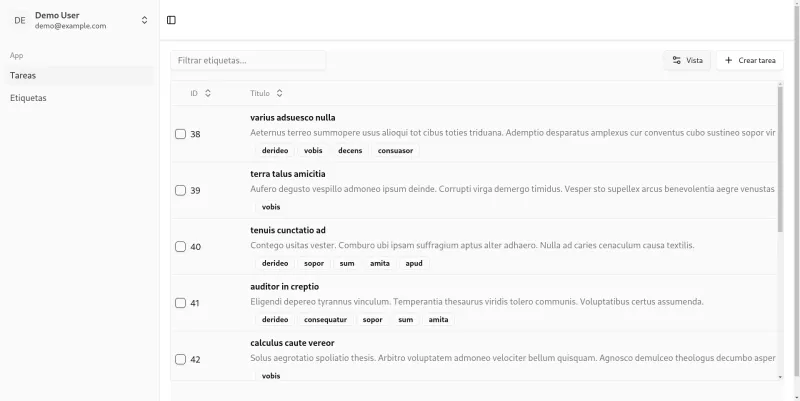
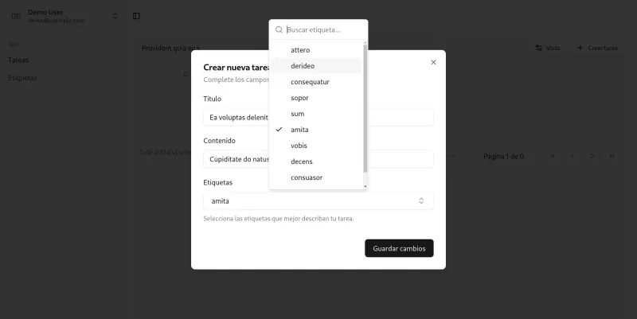

# SV-Gestion-Tarea

Aplicación web para la gestión de tareas y etiquetas, desarrollada con React, Tailwind CSS y TypeScript.
Esta aplicación permite a los usuarios registrarse, iniciar sesión, crear, actualizar y eliminar tareas y etiquetas, así como también cambiar el estado de las tareas y asignar etiquetas a las tareas.
Para la autenticación se utiliza un servidor de backend desarrollado con NestJS, Prisma y Supabase.

## 🚀 Demo

La aplicación está desplegada en Firebase Hosting y se puede acceder a ella en el siguiente enlace: [SV-Gestion-Tarea](https://sv-gestion-tarea.web.app/)
Para acceder a la aplicación se puede utilizar las siguientes credenciales:

- Email: `demo@example.com`
- Contraseña: `password`

## Tabla de Contenidos

- [Imagenes del Proyecto](#imagenes-del-proyecto)
- [Tecnologías Utilizadas](#tecnologías-utilizadas)
- [Instalación](#instalación)
- [Funcionalidades](#funcionalidades)
- [Variables de Entorno](#variables-de-entorno)

## Imagenes del Proyecto




## 🛠️ Tecnologías Utilizadas

- [Axios](https://axios-http.com/)
- [React](https://reactjs.org/)
- [Vite](https://vitejs.dev/)
- [Tailwind CSS](https://tailwindcss.com/)
- [ShadCN](https://shadcn.com/)
- [Radix](https://www.radix-ui.com/)
- [React Hook Form](https://react-hook-form.com/)
- [React Router](https://reactrouter.com/)
- [TypeScript](https://www.typescriptlang.org/)
- [TanStack React Query](https://tanstack.com/query/latest)
- [TanStack React Table](https://tanstack.com/table/latest)
- [Zod](https://zod.dev/)

## Instalación

### Requisitos Previos

- Node.js (https://nodejs.org/)
- npm (https://www.npmjs.com/)

### Pasos de Instalación

1. Clona el repositorio:
   ```bash
   git clone https://github.com/santiagoarielv98/sv-gestion-tarea.git
   ```
2. Navega al directorio del proyecto:
   ```bash
   cd sv-gestion-tarea
   ```
3. Instala las dependencias:
   ```bash
   npm install
   ```
4. Crea un archivo `.env` en la raíz del proyecto y copia el contenido del archivo `.env.example`.
5. Configura las variables de entorno en el archivo `.env`.
6. Inicia la aplicación:
   ```bash
   npm run dev
   ```
7. La aplicación estará disponible en `http://localhost:5173`.

- Nota: Para poder utilizar la aplicación, se debe tener el servidor del backend levantado. Para más información, [ver la documentación del backend.](https://github.com/santiagoarielv98/sv-gestion-tarea-api.git)

## Funcionalidades

- Crear, editar y eliminar tareas.
- Autenticación de usuarios.
- Crear, editar y eliminar etiquetas.
- Asignar etiquetas a tareas.

## Variables de Entorno

Solo una variable de entorno es necesaria para la aplicación:

- `VITE_API_URL`: URL de la API del backend (obligatorio).
